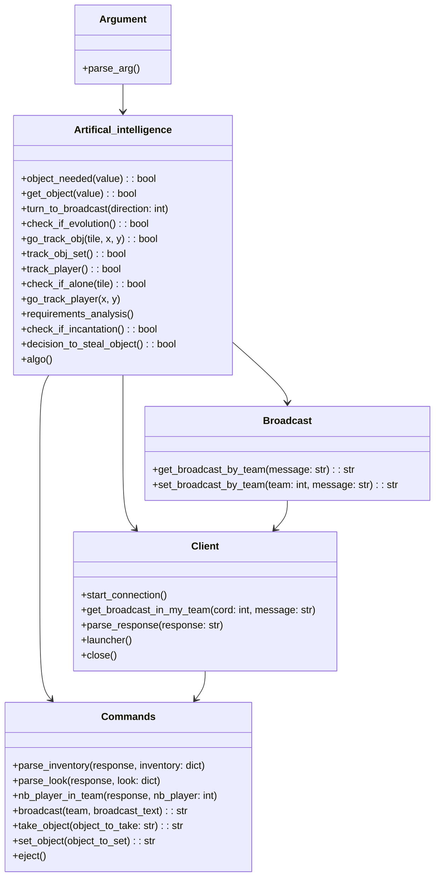
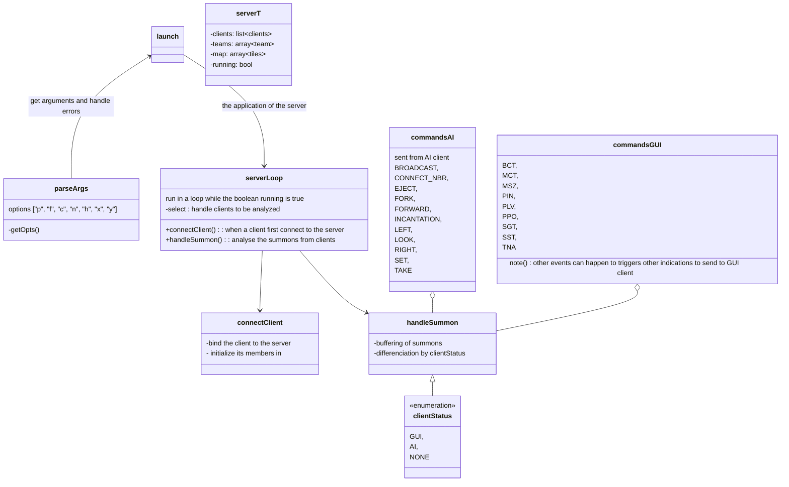

# Zappy - Relations

Diagrams to show each of the projects' architecture.

## AI


## GUI
```mermaid
classDiagram
    GUI --> DisconnectPanel
    GUI --> Client
    GUI --> SceneManager
    IScene <|-- AScene
    IScene <|-- SceneManager
    AScene <|-- Game
    AScene <|-- Victory
    SceneManager --> Game
    SceneManager --> Victory
    SceneManager --> MusicManager
    Game --> HUD
    Game --> Map
    Game --> Camera
    Game --> PlayerManager
    Game --> WeatherManager
    Game --> EggManager
    WeatherManager --> ParticleEngine
    ParticleEngine --> AParticle
    AParticle <|-- RainParticle
    AParticle <|-- FogParticle
    HUD --> FrequencyPanel
    PlayerManager --> Player
    class GUI {
        +void updateWindow();
        +void clearWindow();
        +void eventManager();
        +void changeScene(size_t index);
        +void draw();
        +int start();
    }
    class DisconnectPanel {
        +void manageEvent(sf::RenderWindow &, sf::Event &);
        +void draw(sf::RenderWindow &);
        +void triggerPanel();
    }
    class Client {
        +void sendCommand(const std::string &);
        +void receiveCommand(zappy::SceneManager &, sf::RenderWindow &);
        +void sendGraphic();
        +bool WelcomeSuppressor();
        +[[nodiscard]] sf::Socket::Status getSocketStatus();
    }
    class SceneManager {
        +void draw(sf::RenderWindow &);
        +void manageEvent(sf::RenderWindow &, sf::Event &, std::string &);
        +void changeScene(size_t);
        +size_t getSceneIndex();
    }
    class MusicManager {
        +void fade();
        +void loadNewMusic(const std::string &str);
        +void playMusic();
        +void pauseMusic();
    }
    class IScene {
        +virtual void draw(sf::RenderWindow &);
        +virtual void manageEvent(sf::RenderWindow &, sf::Event &, std::string &);
    }
    class AScene {
        #sf::Sprite m_sprite;
        #sf::Texture m_texture;
    }
    class Game {
            +void draw(sf::RenderWindow &);
            +void manageEvent(sf::RenderWindow &, sf::Event &, std::string &);
            +void createMap(Msz &map, sf::RenderWindow &);
            +void changeTileInventory(Bct &);
            +void addPlayer(Pnw &);
            +void movePlayer(Ppo &);
            +void changePlayerInventory(Pin &);
            +void changePlayerLevel(Plv &);
            +void expulsePlayer(Pex &);
            +void broadcast(Pbc &);
            +void startIncantation(Pic &);
            +void endIncantation(Pie &);
            +void eggGoingLayed(Pkf &);
            +void ressourceDropping(Pdr &);
            +void ressourceCollecting(Pgt &);
            +void playerDeath(Pdi &);
            +void eggLayed(Enw &);
            +void playerEggConnect(Ebo &);
            +void eggDeath(Edi &);
            +void getTimeUnit(Sgt &);
            +void getTimeUnitModifier(Sst &);
            +void winTeam(Seg &);
            +void servorMsg(Smg &);
    }
    class HUD {
        +void draw(sf::RenderWindow &, sf::Sprite &);
        +void displayFocusedTile(zappy::Tile &);
        +void setFocusedTile(zappy::Tile &);
        +void setFocusedPlayer(zappy::Player &);
        +void eventManager(sf::Event &, sf::RenderWindow &,
                              std::string &);
        +void turnHUD(bool, bool);
        +void addBroadcast(Pbc &);
    }
    class FrequencyPanel {
        +void draw(sf::RenderWindow &, sf::Text &);
        +void manageEvent(sf::RenderWindow &, sf::View &, sf::Event &, std::string &);
    }
    class Map {
        void draw(sf::RenderWindow &window, sf::Sprite &);
        std::vector<std::vector<Tile>> getMap() const;
        bool selectTile(sf::Event &, sf::RenderWindow &);
        void modifyTile(Bct &);
        void animateCursor();
        void setCursor(bool);
        Tile &getSelectedTile();
    }
    class Camera {
        +void cameraOnKeyPressed(sf::Event &);
        +void cameraOnKeyReleased(sf::Event &);
        +void moveView(sf::RenderWindow &);
    }
    class PlayerManager {
        +void animatePlayers();
        +void addPlayer(Pnw &);
        +void changePlayerStats(Ppo &);
        +void changePlayerStats(Plv &);
        +void drawPlayers(sf::RenderWindow &, sf::Sprite &sprite);
        +void eventManager(sf::RenderWindow &, sf::Event &event);
        +void setMapSize(sf::Vector2i &);
        +void expulsePlayer(Pex &);
        +void playerDeath(Pdi &);
        +bool selectPlayer(sf::Event &, sf::RenderWindow &);
        +void deletePlayers();
        +void startIncantation(Pic &);
        +void endIncantation(Pie &);
        +Player &getSelectedPlayer();
    }
    class Player {
        +void movePlayer(int pos_x, int pos_y, Orientation orientation);
        +void animatePlayer(sf::Vector2i &size);
        +void drawPlayer(sf::RenderWindow &window, sf::Sprite &sprite, sf::Vector2i &size);
        +void setPlayerLevel(int level);
        +void setPlayerInventory(Inventory &inventory);
        +void triggerDeath();
        +void triggerSelection(bool status);
        +void triggerExpulse();
        +void triggerElevation(bool status);
        +int getId() const;
        +sf::Vector2f getWorldPosition() const;
        +sf::Vector2i getLocalPosition() const;
        +Inventory getInventory() const;
        +bool canDeletePlayer() const;
        +sf::FloatRect getColliderBox() const;
        +const std::string &getTeam() const;
        +int getLevel() const;
        +bool getDeathStatus() const;
    }
    class WeatherManager {
        +void checkWeather(zappy::MusicManager &);
        +void draw(sf::RenderWindow &);
    }
    class AParticle {
        +void draw(sf::RenderWindow &);
        +void moveShape();
        +void setDelete();
        +bool canDelete() const;
    }
    class EggManager {
        +void eggIdleAnimation(size_t);
        +void eggHatchAnimation(size_t, zappy::PlayerManager &);
        +void eggDeathAnimation(size_t);
        +void addEggs(Enw &);
        +void eggHatch(Ebo &);
        +void eggDeath(Edi &);
        +void drawEgg(sf::RenderWindow &, sf::Sprite &, zappy::PlayerManager &);
    }
    class Victory {
        +void setVictoryTeam(const std::string &);
        +void draw(sf::RenderWindow &);
        +void manageEvent(sf::RenderWindow &, sf::Event &, std::string &);
    }
```

## Server

